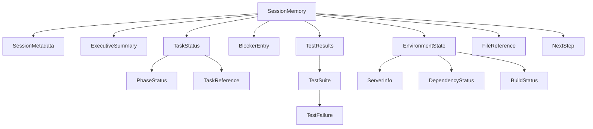

# Data Model: Session Memory File

**Feature**: 001-session-memory-file
**Date**: 2025-12-25
**Status**: Complete

## Overview

This document defines the TypeScript data model for the session memory file feature. All types represent the structured data captured and serialized to `.claude/session-memory.md`.

## Core Types

### SessionMemory (Root Structure)

The top-level interface representing the complete session memory file.

```typescript
interface SessionMemory {
  metadata: SessionMetadata;
  summary: ExecutiveSummary;
  taskStatus: TaskStatus;
  blockers: BlockerEntry[];
  testResults: TestResults;
  environment: EnvironmentState;
  filesNeedingAttention: FileReference[];
  nextSteps: NextStep[];
}
```

**Rationale**: Matches markdown template structure from research.md. Each section maps to a first-class field for type-safe access and testing.

---

### SessionMetadata

Tracks when and where the memory file was generated.

```typescript
interface SessionMetadata {
  projectName: string;          // Extracted from package.json or directory name
  generatedAt: string;          // ISO 8601 timestamp
  branch: string;               // Current git branch
  sessionDuration?: string;     // Time since last save, e.g., "2h 15m" (optional)
  version: string;              // Session memory format version, e.g., "1.0"
}
```

**Constraints**:
- `generatedAt` MUST be ISO 8601 format (e.g., `2025-12-25T14:30:00Z`)
- `branch` MUST be current git branch or "unknown" if not in git repo
- `version` MUST be semantic version string

---

### ExecutiveSummary

Five-sentence summary for quick scanning (FR-007).

```typescript
interface ExecutiveSummary {
  projectDescription: string;    // "ElectroMate - electrical engineering calculation platform"
  completionStatus: string;      // "60/155 tasks complete (38.7%)"
  currentPhase: string;          // "Core Development"
  majorBlocker: string | null;   // "Database setup blocked: missing .env.local" or null
  nextAction: string;            // "Create .env.local and configure NEON_DATABASE_URL"
}
```

**Constraints**:
- Each field MUST be a single sentence (no newlines)
- `completionStatus` MUST include fraction and percentage
- `majorBlocker` is `null` if no high-priority blockers exist

---

### TaskStatus

Task completion metrics extracted from `tasks.md`.

```typescript
interface TaskStatus {
  sourceFile: string;            // Path to tasks.md, e.g., "specs/001-feature/tasks.md"
  phases: PhaseStatus[];
  currentTask: TaskReference | null;
  nextTasks: TaskReference[];
}

interface PhaseStatus {
  name: string;                  // Phase name, e.g., "Setup", "Core", "Testing"
  completed: number;
  total: number;
  percentage: number;            // Computed: (completed / total) * 100
}

interface TaskReference {
  id: string;                    // Task ID, e.g., "T032"
  title: string;                 // Task title
  phase: string;                 // Phase name
}
```

**Constraints**:
- `sourceFile` MUST be relative path from project root
- `percentage` MUST be rounded to 1 decimal place
- `currentTask` is `null` if all tasks complete or none started
- `nextTasks` array limited to max 5 tasks (truncate if more)

**Extraction Logic**:
- Parse `tasks.md` markdown structure
- Identify tasks marked complete (e.g., `- [x]` or `✅`)
- Group by phase (identified by `## Phase:` headings or similar)
- Current task = first incomplete task
- Next tasks = subsequent 3-5 incomplete tasks

---

### BlockerEntry

Documented impediments preventing progress (FR-003).

```typescript
interface BlockerEntry {
  priority: 'high' | 'medium' | 'low';
  taskId: string | null;         // Affected task ID, e.g., "T032" or null if project-wide
  title: string;                 // Short description, e.g., "Missing .env.local file"
  description: string;           // Detailed explanation
  requiredAction: string;        // Actionable resolution step
  detectedAt?: string;           // ISO 8601 timestamp when blocker was identified (optional)
}
```

**Constraints**:
- Max 50 blockers (truncate low-priority if exceeded)
- `title` MUST be ≤100 characters
- `requiredAction` MUST be actionable (imperative verb: "Create", "Fix", "Install")

**Detection Heuristics**:
- Keywords in code comments: `TODO`, `FIXME`, `BLOCKED`, `NEEDS`
- Test failures (failing tests are implicit blockers)
- Missing files referenced in tasks (e.g., `.env.local`)
- Build/type errors from recent commands

---

### TestResults

Summary of test execution (FR-004).

```typescript
interface TestResults {
  lastRun: string | null;        // ISO 8601 timestamp or null if never run
  unit: TestSuite;
  e2e: TestSuite;
}

interface TestSuite {
  framework: string;             // "Vitest", "Playwright", "Jest", etc.
  status: 'passed' | 'failed' | 'not-run';
  passed: number;
  failed: number;
  total: number;
  percentage: number;            // Pass rate: (passed / total) * 100
  failures: TestFailure[];       // Details of failed tests
  command: string;               // Command to run tests, e.g., "npm test"
}

interface TestFailure {
  file: string;                  // Relative path to test file
  line?: number;                 // Line number of failure (if available)
  testName: string;              // Name of failing test
  message?: string;              // Short error message (first line, max 200 chars)
}
```

**Constraints**:
- `failures` array max 20 entries (truncate with "... and X more failures")
- `percentage` rounded to 1 decimal place
- `message` sanitized to remove sensitive data (via sensitive-data-filter)

**Extraction Logic**:
- Parse test output from recent runs (if cached/logged)
- Vitest: Parse JSON reporter output if available
- Playwright: Parse HTML report or console output
- Fallback: Show status as "not-run" if no recent results

---

### EnvironmentState

Development environment configuration (FR-005).

```typescript
interface EnvironmentState {
  servers: ServerInfo[];
  dependencies: DependencyStatus;
  build: BuildStatus;
}

interface ServerInfo {
  process: string;               // Process name: "npm", "node", "python"
  port: number;
  url: string;                   // e.g., "http://localhost:3001"
  pid?: number;                  // Process ID (if detectable)
  status: 'running' | 'stopped';
}

interface DependencyStatus {
  status: 'up-to-date' | 'outdated' | 'unknown';
  lastInstall: string | null;    // ISO 8601 timestamp or null
  packageManager: 'npm' | 'yarn' | 'pnpm' | 'bun' | 'unknown';
  outdatedCount?: number;        // Number of outdated packages (if detected)
}

interface BuildStatus {
  status: 'success' | 'failed' | 'not-run';
  lastBuild: string | null;      // ISO 8601 timestamp or null
  outputDir?: string;            // Build output directory, e.g., ".next/", "dist/"
  errors?: string[];             // Build errors (max 10, truncated)
}
```

**Constraints**:
- `servers` max 20 entries (unlikely to exceed, but safeguard)
- `errors` array max 10 entries with max 200 chars each
- `url` MUST NOT contain authentication credentials (filtered)

**Detection Logic**:
- **Servers**: Use OS commands from research.md (netstat/lsof)
- **Dependencies**: Check `package-lock.json` mtime, compare to `node_modules`
- **Build**: Check for `.next/` or `dist/` directory mtime

---

### FileReference

Files requiring attention (FR-008).

```typescript
interface FileReference {
  path: string;                  // Relative path from project root
  line?: number;                 // Line number (if applicable)
  reason: string;                // Why it needs attention
  priority: 'high' | 'medium' | 'low';
}
```

**Constraints**:
- Max 50 files (truncate low-priority if exceeded)
- `reason` MUST be actionable, e.g., "Type error", "Failing test", "TODO comment"

**Sources**:
- Failing test files
- Files with build/type errors
- Files with `TODO`/`FIXME` comments (if easy to detect)

---

### NextStep

Recommended actions prioritized by importance (FR-006).

```typescript
interface NextStep {
  priority: 'immediate' | 'short-term' | 'medium-term' | 'long-term';
  action: string;                // Actionable description with imperative verb
  reference?: string;            // Optional file/task reference
}
```

**Constraints**:
- Max 10 steps (reasonable limit for actionability)
- `action` MUST start with imperative verb: "Fix", "Create", "Run", "Complete"

**Generation Logic**:
- **Immediate**: High-priority blockers, failing tests
- **Short-term**: Current phase incomplete tasks
- **Medium-term**: Next phase preparation
- **Long-term**: Future enhancements (from spec, if applicable)

---

## Markdown Serialization

Each interface maps to a markdown section in `.claude/session-memory.md`:

| Interface | Markdown Section | Format |
|-----------|------------------|--------|
| `SessionMetadata` | Header (frontmatter) | Key-value pairs |
| `ExecutiveSummary` | `## Executive Summary` | Numbered list |
| `TaskStatus` | `## Task Status` | Table + lists |
| `BlockerEntry[]` | `## Blockers` | Subsections by priority |
| `TestResults` | `## Test Results` | Subsections per suite |
| `EnvironmentState` | `## Environment State` | Subsections with lists |
| `FileReference[]` | `## Files Needing Attention` | Numbered list |
| `NextStep[]` | `## Next Steps` | Numbered list grouped by priority |

**Serialization Strategy**:
```typescript
function serializeToMarkdown(memory: SessionMemory): string {
  return `
# Session Memory: ${memory.metadata.projectName}

**Generated**: ${memory.metadata.generatedAt}
**Branch**: ${memory.metadata.branch}
${memory.metadata.sessionDuration ? `**Session Duration**: ${memory.metadata.sessionDuration}` : ''}

## Executive Summary

1. ${memory.summary.projectDescription}
2. ${memory.summary.completionStatus}
3. Current phase: ${memory.summary.currentPhase}
4. ${memory.summary.majorBlocker || 'No critical blockers'}
5. Next action: ${memory.summary.nextAction}

## Task Status

**Source**: ${memory.taskStatus.sourceFile}

${renderPhaseTable(memory.taskStatus.phases)}

**Current Task**: ${renderTaskReference(memory.taskStatus.currentTask)}

**Next Tasks**: ${memory.taskStatus.nextTasks.map(renderTaskReference).join(', ')}

## Blockers

${renderBlockers(memory.blockers)}

## Test Results

${renderTestResults(memory.testResults)}

## Environment State

${renderEnvironment(memory.environment)}

## Files Needing Attention

${renderFiles(memory.filesNeedingAttention)}

## Next Steps

${renderNextSteps(memory.nextSteps)}

---

*Generated by Claude Code Session Memory v${memory.metadata.version}*
  `.trim();
}
```

---

## Parsing (for validation and loading)

The parser reads `.claude/session-memory.md` back into `SessionMemory` interface:

```typescript
function parseMarkdown(content: string): SessionMemory {
  // 1. Extract metadata from header
  // 2. Parse each section by heading anchor
  // 3. Parse tables (task status, test results)
  // 4. Parse lists (blockers, next steps, files)
  // 5. Validate structure and types
  // 6. Return SessionMemory object or throw ParseError
}
```

**Error Handling**:
- Missing required sections → return partial data with warnings
- Invalid timestamps → fallback to "unknown"
- Corrupted tables → skip section, log warning
- Empty file → return default "No session data" structure

---

## Relationships



---

## Validation Rules

All types MUST pass these validation rules:

1. **Timestamps**: ISO 8601 format or null
2. **Percentages**: 0.0-100.0, rounded to 1 decimal
3. **Paths**: Relative paths from project root, forward slashes
4. **Priorities**: Enum values only ('high' | 'medium' | 'low')
5. **Array Limits**: Enforced max lengths per type
6. **No Sensitive Data**: All string fields filtered via `sensitive-data-filter`

```typescript
function validate(memory: SessionMemory): ValidationResult {
  const errors: string[] = [];

  // Validate metadata timestamps
  if (memory.metadata.generatedAt && !isValidISO8601(memory.metadata.generatedAt)) {
    errors.push('metadata.generatedAt must be ISO 8601 format');
  }

  // Validate percentages
  for (const phase of memory.taskStatus.phases) {
    if (phase.percentage < 0 || phase.percentage > 100) {
      errors.push(`phase.percentage out of range: ${phase.percentage}`);
    }
  }

  // Validate array limits
  if (memory.blockers.length > 50) {
    errors.push('blockers array exceeds max length (50)');
  }

  // Validate sensitive data filtering
  const content = serializeToMarkdown(memory);
  if (containsSensitiveData(content)) {
    errors.push('Sensitive data detected in serialized output');
  }

  return { valid: errors.length === 0, errors };
}
```

---

## Test Cases

### Nominal Case

```typescript
const validSessionMemory: SessionMemory = {
  metadata: {
    projectName: 'ElectroMate',
    generatedAt: '2025-12-25T14:30:00Z',
    branch: '001-session-memory-file',
    sessionDuration: '2h 15m',
    version: '1.0',
  },
  summary: {
    projectDescription: 'ElectroMate - electrical engineering calculation platform',
    completionStatus: '60/155 tasks complete (38.7%)',
    currentPhase: 'Core Development',
    majorBlocker: 'Database setup blocked: missing .env.local',
    nextAction: 'Create .env.local and configure NEON_DATABASE_URL',
  },
  taskStatus: { /* ... */ },
  blockers: [
    {
      priority: 'high',
      taskId: 'T032',
      title: 'Missing .env.local file',
      description: 'Database connection requires NEON_DATABASE_URL',
      requiredAction: 'Create .env.local from .env.local.example',
    },
  ],
  testResults: { /* ... */ },
  environment: { /* ... */ },
  filesNeedingAttention: [],
  nextSteps: [],
};

// Should serialize to valid markdown and parse back correctly
const markdown = serializeToMarkdown(validSessionMemory);
const parsed = parseMarkdown(markdown);
expect(parsed).toEqual(validSessionMemory);
```

### Edge Cases

- **Empty project**: No tasks, no tests, no servers → should generate minimal valid markdown
- **All tests passing**: No failures array, 100% pass rate
- **No blockers**: `majorBlocker: null` in summary
- **Large project**: 200+ tasks → should truncate nextTasks to 5
- **Corrupted markdown**: Missing sections → parser should return partial data with warnings

---

## Summary

This data model provides:
- ✅ Type-safe representation of all memory file sections
- ✅ Clear validation rules for data integrity
- ✅ Serialization strategy to markdown (human-readable)
- ✅ Parsing strategy from markdown (machine-readable)
- ✅ Constraints aligned with spec requirements (50KB limit, sensitive data filtering)
- ✅ Testable structure with nominal and edge case examples
